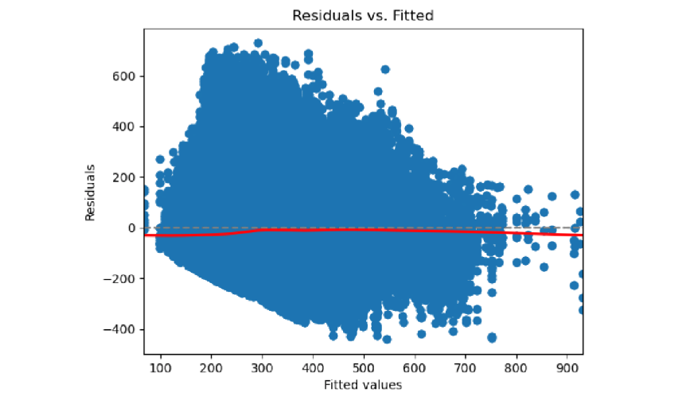
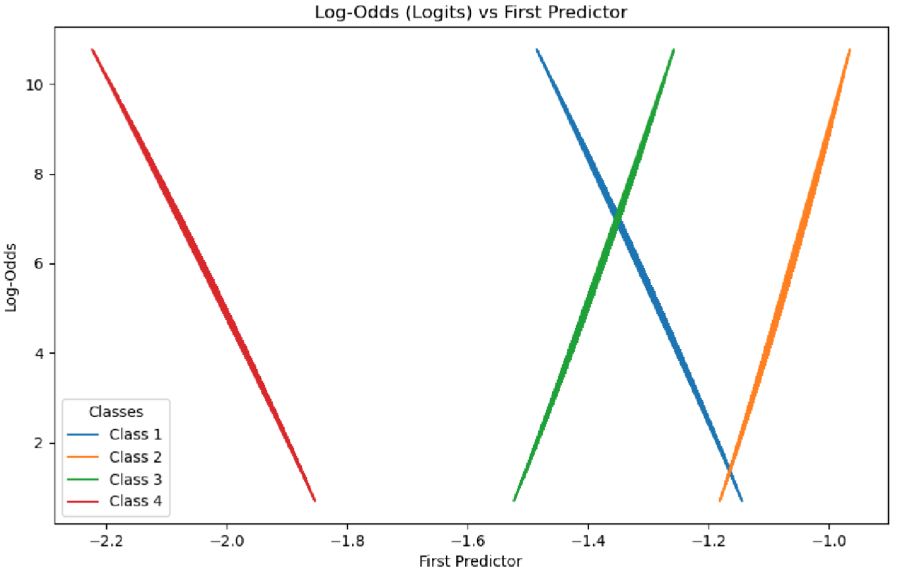

# Data Fusion and Machine Learning for Enhanced Variety Trial Analysis
## Climate Change and Environmental Influences on Wheat Growth

DATA7901 Capstone Project which investigates the environmental effects of climate change on wheat growth (Datasets cannot be published)

# Motivations

The motivations for this project came from the need for global wheat production to increase by 60% to keep up with projected demands against the rise of climate change, in just 5 years. This project addresses the research gap of utilising real-world data in combination with data science techniques and machine learning models to identify the most climate-resistant cultivars (breeds), modelling frost damage, and identifying the weather and soil conditions that lead to the greatest yield. These three objectives are interlinked by the common them of climate change and improving yield to advise farmers and agronomists of various strategies relating to choice of cultivar, frost damage mitigation, and soil.

# Process:

- Cleaning the datasets and merging all datasets into one for a uniform analysis across different attributes for each trial
- Clustering cultivars and their traits and conducting statistical analysis to understand similarities and strengths in yield
- Modelling frost damage using machine learning techniques which is able to input new data to identify whether crops have undergone frost damage or are likely to
- Identifying the weather and soil conditions that lead to greater yield using statistical analysis

# Exploratory Data Analysis (EDA)

This entailed graphing bar graphs of cultivar varieties against yield, cultivar varieties against regions, and the weather/soil conditions of the highest performing cultivars. This assisted in narrowing the investigation to the cultivar varieties with the greatest yield under a subset of weather and soil conditions and regions.

# Objective 1: Identify the Most Climate-Resistant Cultivars

The first objective is to find the most climate-resistant cultivars or the breeds of wheat that net the highest yield across multiple environments, regions, and weather conditions. I used *multiple linear regression* and *hierarchical clustering* to estimate yield performance based on id and environmental variables. I used the *coefficient of variation* after the clustering to identify the groups with the most stable mean yields. Finding the most stable clusters relates to the objective as the most stable cultivars will have consistent performance in yield throughout various environments. Some issues that I had to overcome was choosing between k-means and hierarchical clustering and chose hierarchical since the clusters were not found to be spherical between each cultivar and its mean yields.

Multiple linear regression was chosen out of *random forest regression* and *clustering methods* since the residual plot was a straight line which fell in accordance with the linearity assumption.

Multicollinearity was examined using Variance Inflation Factors (VIF) with VIFs greater than 4 requiring investigation and anything above 10 requiring serious correction or unable to be used. The implementation for the *Random Forest model* required some feature engineering such as calculating total rainfall as an attribute or using one-hot encoding for the ids of the cultivar. I trained this model on the merged dataset and evaluated the performance using R-squared and RMSE metrics.

For clustering techniques, this focuses less on yield and more on grouping cultivars with similar properties. For each cluster, the average yield and its variance was calculated to identify entire clusters as climate-resistant. Moreover, PCA was used for visualisation. The evaluation metric used was Davies-Bouldin index to quantify the similarities of cultivars within a cluster to other clusters.

# Objective 2: Modelling Frost Damage

The second objective is to predict the level of frost damage from the attributes of a given inputted crop to mitigate damage against the effects of climate change for farmers and agronomists. The cleaned dataset was search for each class of frost damage - from 1 to 4 - and a separate CSV file was created. The models considered was *logistic regression*, *XGBoost*, and *artificial neural networks*. 

Logistic regression requires the assumption that there is a linear relationship between the logits and each predictor variable, no multicollinearity and independence between observations. The latter two have been proven in objective 1. The linearity between the logits and predictor variable is shown below for the first predictor:

*XGBoost* will be similarly implemented with a 60% training, 20% validation and 20% testing split. The validation set will be used to finetune the learning rate, maximum depth and number of estimators. To evaluate this model, I used accuracy and confusion matrices for visualisation of the performance. Furthermore, since *XGBoost* is a collection of tree, the model provides feature importance plots for feature selection of which environmental variables affect frost damage the most. This model has grater performanance benefits, supports regularisation, and has a higher accuracy than *logistic regression*.

Lastly, the *neural network architecture* determines the level of frost damage using a simple neural network architecture with two hidden layers. Grid search was used in arriving at the most effective number of layers and neurons by choosing the hyperparameters that resulted in the least loss. A softmax activation function was used to output the class probabilities for each level of frost damage. The library used for this was *PyTorch*.

# Objective 3: Identifying the Most Productive Environment

The third objective entails identifying the features of the environment most conducive to wheat production. The models being considered for this feature selection/ranking task are *random forest regression* and *lasso regression*. The *random forest* model's feature importance scores are important in identifying the most important environmental features. The model's training process will include only environmental variables as the explanatory variables of the model, using an 80% training and 20% test split. Once the selected features were found, I used *grid search* using the selected features to iterate through every possible combination with the range to identify the combination that results in the highest yield. Also, *constraint-based optimisation* tools can be used to use the selected features as a list of constraints and find the optimal values based on an objective function, namedly using the *Simplex algorithm*.

The second model considered is the *lasso regression* which prioritises feature selection of the environmental variables to find the optimal environment for wheat production. I used a 60% training, 20% validation, and 20% testing set split. This provides enough data for the regularisation parameter to balance the model's complexity. (Jain, 2025) *Lasso regression* performs regularisation which conducts the *feature selection* needed by encouraging sparsity, that is, reducing coefficients to zero. I used *R-squared* and *Mean Squared Error* for interpretability and sensitivity to large errors. I would use *grid search* and *constraint-based optimisation* tools here to find the optimal environment as explained previously.

# References

1. Jain, A. (2025, March 10). *Ridge and lasso regression in Python: A complete tutorial.* Analytics Vidhya. https://www.analyticsvidhya.com/blog/2016/01/ridge-lasso-regression-python-complete-tutorial/
